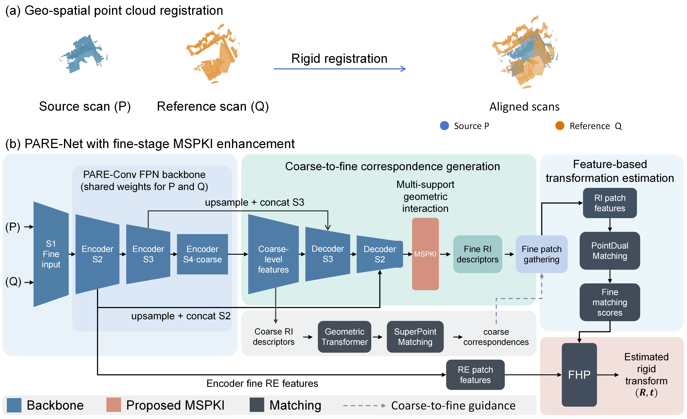
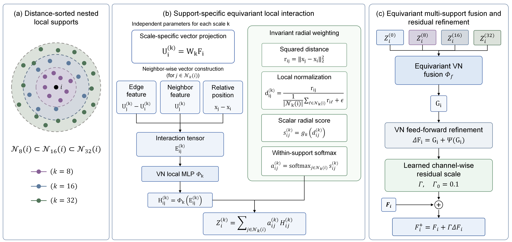
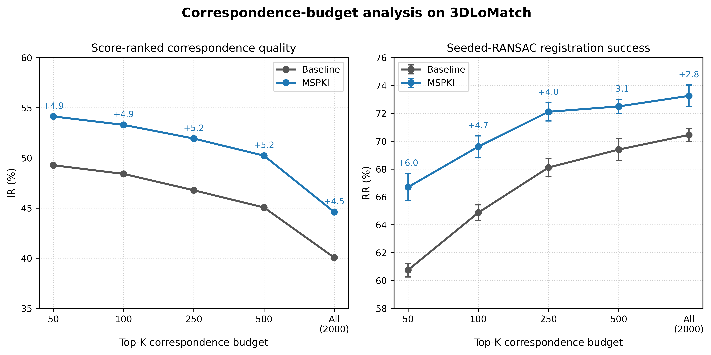
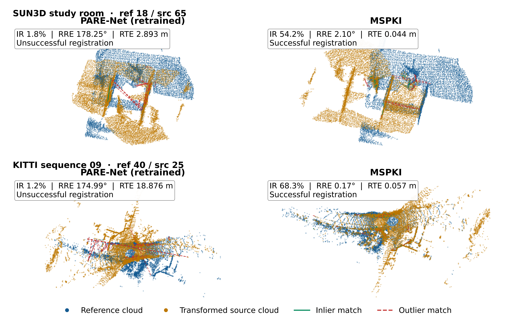

# MSPKI: Multi-Support Point-Kernel Interaction

Implementation, selected checkpoints, and evaluation records for MSPKI, a fine-feature refinement module for point-cloud registration.

MSPKI refines the decoded fine features of PARE-Net before invariant descriptor construction. It uses three nested neighborhoods around each point, with 8, 16, and 32 neighbors. Each support uses a rotation-invariant radial aggregation kernel, and the rotation-equivariant responses remain separate until learned fusion. Under a matched retraining protocol, MSPKI improves correspondence inlier ratio (IR) on 3DMatch, 3DLoMatch, and supervised KITTI, including source-density tests. On 3DLoMatch, the RANSAC registration gain is largest when only a small set of high-confidence correspondences is available.



Blue blocks show the inherited PARE-Net backbone; the orange block is MSPKI. At inference, FHP uses fine matching scores, encoder-derived RE patch features, and point coordinates to estimate the rigid transformation.

<details>
<summary>MSPKI module structure</summary>



The three support responses remain distinct until equivariant fusion. The fused features undergo feed-forward refinement and channel-wise residual scaling before invariant descriptor construction.

</details>

[Environment and data](#environment-and-data) · [Evaluate checkpoints](#evaluate-the-supplied-checkpoints) · [Train models](#train-models) · [Focused controls](#reproduce-the-focused-controls) · [Results](#reported-results)

## Repository contents

| Path | Contents |
| --- | --- |
| `pareconv/` | Registration framework inherited from and modified for PARE-Net and MSPKI. The package name is retained for import and checkpoint compatibility. |
| `experiments/3DMatch/` | Indoor Baseline/MSPKI training, correspondence extraction, registration evaluation, and paper analyses. |
| `experiments/3DMatch_mechanism_ablation/` | Fine-stage mechanism controls, including single-support, three-branch homogeneous-support, and mean-input variants. |
| `experiments/KITTI_mspki/` | Supervised KITTI training, evaluation, and fixed source-density test. |
| `experiments/figure_data_tools/` | Scripts for selecting qualitative pairs and summarizing score-ranked correspondence quality. |
| `data/` | Indoor and KITTI split metadata and indoor benchmark ground truth. Point-cloud data are not included. |
| `output/` | Best-validation checkpoints and resolved configurations for the reported runs. |
| `results/` | Saved numerical results, selected qualitative pair data, and experimental figures. |

`output/checkpoint_manifest.csv` and `results/manifest.csv` record the size and SHA-256 hash of every packaged checkpoint, configuration, and result file. Historical experiments outside the manuscript and supplement are excluded. Archived metadata use neutral run labels and directory names. Numerical results, model tensor values, and recorded original artifact checksums are retained. In the file manifests, `source_sha256` identifies the artifact before label normalization and `sha256` identifies the released file. The corresponding checkpoint rows link archived checkpoint checksums to the released weights. `results/additional_evaluation/reproduction_code_manifest.csv` maps original evaluation-script hashes to the released files.

## Environment and data

Use Python 3.9, a CUDA-compatible PyTorch installation, and the packages in `requirements.txt`. The reported inference environment uses PyTorch 2.1.2+cu121. For CUDA 12.1, install the matching PyTorch packages before the remaining dependencies:

```bash
python -m pip install torch==2.1.2 torchvision==0.16.2 torchaudio==2.1.2 --index-url https://download.pytorch.org/whl/cu121
python -m pip install -r requirements.txt
```

The model requires an NVIDIA GPU with CUDA. The command examples below use Bash syntax and should be run in a Bash shell.

The reported RANSAC controls used Open3D 0.18.0, as pinned in `requirements.txt`. The manuscript reports efficiency measurements with PyTorch 2.1.2+cu121, CUDA 12.1, an NVIDIA GeForce RTX 4090 D for indoor profiling, and an NVIDIA GeForce RTX 4090 for KITTI profiling. Installations with other hardware or library versions may give different timing results. The Python entry points add the repository root to their import path; run the commands below from that root.

Download the preprocessed 3DMatch/3DLoMatch and KITTI point clouds using the instructions in the [PARE-Net repository](https://github.com/yaorz97/PARENet). Place them under the default paths below, or pass `--dataset_root` to individual Python entry points. The split metadata used by this project are already in `data/`.

```text
datasets/
├── 3DMatch/
│   ├── train/...
│   ├── test/...
│   └── train_pair_overlap_masks/...
└── KITTI/
    ├── downsampled/...
    └── train_pair_overlap_masks/...
```

The indoor test metadata contain 1,623 3DMatch pairs and 1,781 3DLoMatch pairs. KITTI uses sequences 00-05 for training, 06-07 for validation, and 08-10 for testing; the test split contains 555 pairs. Both methods use training seeds 2026, 3407, and 7351. The reported indoor comparisons use the `official` RE-feature source and 2,000 FHP hypotheses; KITTI uses the same feature-source convention and 1,000 hypotheses.

## Evaluate the supplied checkpoints

The following commands evaluate the seed-7351 indoor checkpoints on 3DLoMatch. Change `3DLoMatch` to `3DMatch` to evaluate the other indoor benchmark. Each method writes features and evaluation summaries to its own directory under `output/reproduction_indoor/`. To reproduce the three-seed means, repeat the evaluation for seeds 2026, 3407, and 7351, using the corresponding checkpoint paths.

```bash
for variant in baseline mspki; do
  python experiments/3DMatch/test.py \
    --benchmark 3DLoMatch \
    --variant "$variant" --seed 7351 \
    --re_feature_source official \
    --snapshot "output/3DMatch_ablation_new/$variant/re_official/seed_7351/snapshots/best.pth.tar" \
    --output_root output/reproduction_indoor

  python experiments/3DMatch/eval.py \
    --benchmark 3DLoMatch \
    --variant "$variant" --seed 7351 \
    --re_feature_source official --method fhp \
    --output_root output/reproduction_indoor
done
```

KITTI evaluation follows the same extraction-then-evaluation sequence. The example below uses the supplied seed-7351 checkpoints and the complete test split.

```bash
for variant in baseline mspki; do
  python experiments/KITTI_mspki/test.py \
    --variant "$variant" --seed 7351 \
    --re_feature_source official \
    --snapshot "output/KITTI_mspki/$variant/re_official/seed_7351/snapshots/best.pth.tar" \
    --output_root output/reproduction_kitti

  python experiments/KITTI_mspki/eval.py \
    --variant "$variant" --seed 7351 \
    --re_feature_source official \
    --output_root output/reproduction_kitti
done
```

## Train models

The training entry points select checkpoints on validation data. To start new indoor and KITTI runs without writing into the supplied checkpoint directories, use a new `--output_root`:

```bash
python experiments/3DMatch/trainval.py \
  --variant mspki --seed 7351 --re_feature_source official \
  --output_root output/new_indoor_runs

python experiments/KITTI_mspki/trainval.py \
  --variant mspki --seed 7351 --re_feature_source official \
  --output_root output/new_kitti_runs
```

Use `--variant baseline` with the same seed and dataset-specific settings for a paired PARE-Net retraining run. The indoor study trained on the 3DMatch training split and evaluated each selected checkpoint on both 3DMatch and 3DLoMatch. KITTI models were trained separately on the KITTI training split.

Without `--output_root`, new indoor runs use `output/indoor_registration_runs/`. The supplied paper checkpoints remain under their original paths in `output/3DMatch_ablation_new/` so that saved result references still match.

## Reproduce the focused controls

The three-seed RANSAC control uses saved indoor correspondences. First extract 3DLoMatch correspondences for the six supplied checkpoints into `output/reproduction_ransac/`:

```bash
for seed in 2026 3407 7351; do
  for variant in baseline mspki; do
    python experiments/3DMatch/test.py \
      --benchmark 3DLoMatch \
      --variant "$variant" --seed "$seed" \
      --re_feature_source official \
      --snapshot "output/3DMatch_ablation_new/$variant/re_official/seed_$seed/snapshots/best.pth.tar" \
      --output_root output/reproduction_ransac
  done
done

bash experiments/3DMatch/paper_eval_suite/run_ransac_training_seeds.sh
```

The script evaluates the top 50 correspondences and the complete correspondence set with estimator seeds 0–4, then aggregates results within each training seed. This is the 3DLoMatch extension reported in the manuscript and supplement. The archived results are in `results/retest_20260927/` and `results/ransac_repeated_estimator_seeds/`.

For the complete KITTI source-density experiment, place the data at `datasets/KITTI/` and run:

```bash
bash experiments/KITTI_mspki/run_density_stress.sh --dry-run
bash experiments/KITTI_mspki/run_density_stress.sh
```

The script uses all six supplied KITTI checkpoints, mask seed 9017, and source-point retention of 100%, 75%, 50%, and 25%. The target point cloud is unchanged, and Baseline and MSPKI receive the same nested source subsets. The numerical outputs underlying the paper are in `results/retest_20260927/`.

The other reported controls are implemented in `experiments/3DMatch_mechanism_ablation/` and `experiments/3DMatch/paper_eval_suite/`. Their archived outputs are grouped by experiment under `results/`, including `n8_single_support/`, `n16_single_support/`, `n32_single_scale/`, `mean_input_control/`, `uniform_control/`, `coarse_stage_control/`, `overlap_bins/`, `robustness/`, `scene_statistics/`, `efficiency_profile_raw/`, and `equivariance/`.

### Three-branch homogeneous-support controls

The repeated-support controls keep three independently parameterized branches and the same 3,904,590 parameters as the mixed 8/16/32 configuration. They use one training seed, 7351. Their selected checkpoints are in `output/3DMatch_homogeneous_ablation/`, and complete indoor summaries and pair records are in `results/additional_evaluation/homogeneous_support/`.

```bash
for extent in 8 16 32; do
  python experiments/3DMatch_mechanism_ablation/trainval.py \
    --variant mspki --seed 7351 --re_feature_source official \
    --mspki_scales "$extent" "$extent" "$extent" \
    --output_root output/new_homogeneous_runs

  for benchmark in 3DMatch 3DLoMatch; do
    python experiments/3DMatch_mechanism_ablation/test.py \
      --variant mspki --seed 7351 --re_feature_source official \
      --mspki_scales "$extent" "$extent" "$extent" --benchmark "$benchmark" \
      --snapshot "output/3DMatch_homogeneous_ablation/mspki/re_official/seed_7351/ms$extent-$extent-$extent/snapshots/best.pth.tar" \
      --output_root output/reproduction_homogeneous
    python experiments/3DMatch_mechanism_ablation/eval.py \
      --variant mspki --seed 7351 --re_feature_source official \
      --mspki_scales "$extent" "$extent" "$extent" --benchmark "$benchmark" \
      --output_root output/reproduction_homogeneous
  done
done
```

The first command trains a new control. The extraction and evaluation commands use the supplied checkpoint and do not require training.

| Supports | 3DMatch IR | 3DMatch RR | 3DLoMatch IR | 3DLoMatch RR |
| --- | ---: | ---: | ---: | ---: |
| 8/8/8 | 74.93% | 94.26% | 44.67% | 77.20% |
| 16/16/16 | 75.46% | 94.46% | 44.79% | 77.35% |
| 32/32/32 | 74.90% | 94.84% | 44.17% | 76.09% |
| 8/16/32 (final MSPKI) | 76.24% | 94.08% | 45.83% | 77.76% |

### Additional outdoor evaluations

`experiments/KITTI_mspki/additional_evaluation/` contains the shared-RANSAC budget and iteration-limit evaluations, KITTI efficiency profiling, the official GeoTransformer adapter, and paired density diagnostics. These commands run evaluation with trained models; they do not train a network. New outputs use `output/KITTI_additional/`. The completed experiment records are archived in `results/additional_evaluation/`.

For the reported KITTI budget experiment, first create the complete-density caches for all six supplied models using the density script above. The budget evaluation explicitly uses the latest full-density cache tag:

```bash
python experiments/KITTI_mspki/additional_evaluation/run_budget.py \
  --cache-tag density_src_r100_m9017 --dry-run
python experiments/KITTI_mspki/additional_evaluation/run_budget.py \
  --cache-tag density_src_r100_m9017
```

Each of the 555 test pairs is evaluated at budgets 50/100/250/500/All, with three training seeds and five estimator seeds. All uses the complete 1,000-correspondence cache. Open3D 0.18.0 RANSAC uses a 0.3 m distance threshold, four-point samples, 5,000 maximum iterations, and confidence 0.999. The random seed is reset before each pair. Estimator repetitions are averaged within each training seed before computing the sample SD across training seeds. MSPKI has higher IR at every tested budget; the pose-success differences depend on the budget and training seed. Complete results are retained in `results/additional_evaluation/budget/`.

The paired density transitions can be reproduced directly from the bundled CSV/manifest archive:

```bash
python experiments/KITTI_mspki/additional_evaluation/density_diagnostics.py --ratios 0.5 0.25
```

Spatial diagnostics also need saved correspondence coordinates. To extract matching coordinates into a new directory and analyze them:

```bash
python experiments/KITTI_mspki/additional_evaluation/prepare_density_caches.py --ratios 0.5 0.25
python experiments/KITTI_mspki/additional_evaluation/density_diagnostics.py \
  --ratios 0.5 0.25 --geometry \
  --cache-root output/KITTI_additional/density_cache/KITTI_mspki \
  --archive output/KITTI_additional/density_cache/density_analysis_complete.tar.gz \
  --output output/KITTI_additional/density_geometry_reproduced
```

Occupied inlier cells use a 2 m grid in the reference frame. Cell fraction is measured relative to all predicted correspondences in a pair. The counts describe the spatial distribution of matched inliers. Results for both recovered and reversed registrations are retained in `results/additional_evaluation/density_geometry/`.

The external comparison uses the [official GeoTransformer repository](https://github.com/qinzheng93/GeoTransformer) at commit `e7a135af4c318ff3b8d7f6c963df094d7e4ea540` and its [released KITTI checkpoint](https://github.com/qinzheng93/GeoTransformer/releases). Install that implementation and its compiled operators in a separate environment according to its README. Place the repository at `third_party/GeoTransformer/` and its `geotransformer-kitti.pth.tar` checkpoint under `third_party/GeoTransformer/weights/`. The external source and weights are obtained upstream and are not bundled here. The reported checkpoint SHA-256 is `39cd6a01de6430c656eb8c9d67997f334f0a38c446dd8884b16a654e2b233237`.

From this repository root, in the GeoTransformer environment, run:

```bash
python experiments/KITTI_mspki/additional_evaluation/run_geotransformer.py \
  --geo-root third_party/GeoTransformer \
  --snapshot third_party/GeoTransformer/weights/geotransformer-kitti.pth.tar \
  --ratios 1.0 0.5 --neighbor-limits 64 65 74 80 79
```

This evaluates one released checkpoint on the same KITTI inputs and source-mask rule. GeoTransformer uses LGR and its native correspondence set; Baseline and MSPKI use FHP with 1,000 correspondences. Archived outputs include native IR, score-ranked top-1,000 IR, correspondence counts, native TR, mask hashes, and common-success pose comparisons. The released external checkpoint is evaluated separately from the matched PARE-Net/MSPKI training controls. Those records are in `results/additional_evaluation/external_baseline/`.

```bash
python experiments/KITTI_mspki/additional_evaluation/verify_protocol.py
```

This checks syntax, mask equivalence, metric thresholds, and archived density-transition counts without GPU inference.

### KITTI iteration-limit control and efficiency

The top-50 iteration control uses the same six full-density caches and estimator seeds 0-4 at maximum iteration counts of 5,000, 10,000, and 50,000. Each condition evaluates all 555 test pairs. Run it after preparing the full-density caches:

```bash
for iterations in 5000 10000 50000; do
  python experiments/KITTI_mspki/additional_evaluation/run_budget.py \
    --cache-tag density_src_r100_m9017 --budgets 50 \
    --iterations "$iterations" \
    --output "output/KITTI_additional/ransac_iterations/iter_$iterations"
done
```

The archived summaries, protocols, 90 pair-level CSVs, and paired training-seed results are in `results/additional_evaluation/ransac_iterations/`. Estimator repetitions are averaged within training seed before calculating the three-seed mean and sample SD. Correspondence IR remains fixed across iteration settings; the change in mean TR is below 0.1 percentage points for each method.

KITTI efficiency uses fixed seed-7351 checkpoints, full-density inputs, 20 warm-up pairs and 100 timed pairs, with five independent processes per model:

```bash
for variant in baseline mspki; do
  for run in 1 2 3 4 5; do
    python experiments/KITTI_mspki/additional_evaluation/profile_kitti.py \
      --variant "$variant" --seed 7351 --re_feature_source official \
      --snapshot "output/KITTI_mspki/$variant/re_official/seed_7351/snapshots/best.pth.tar" \
      --output_root "output/KITTI_additional/kitti_efficiency/runtime/$variant/run_$run" \
      --warmup_pairs 20 --profile_pairs 100 --density_keep_ratio 1.0 \
      --profile_output "output/KITTI_additional/kitti_efficiency/runs/${variant}_run${run}.json"
  done
done
```

Latency covers model forward computation and pose estimation. Data loading, host-to-device transfer, ground-truth computation, and result saving are excluded. The KITTI peak allocated memory covers warm-up and timed inference. Mean latency is calculated from five independent run means, and its SD is the sample SD across those means. The reported KITTI hardware is RTX 4090. The ten JSON records and runtime logs are in `results/additional_evaluation/kitti_efficiency/`.

The bundled records can be checked and summarized without GPU inference:

```bash
python experiments/KITTI_mspki/additional_evaluation/summarize_iterations_efficiency.py
```

To summarize new runs instead, pass `--root output/KITTI_additional`. The script checks every archived pair record and per-pair timing value before writing summaries under `output/KITTI_additional/summaries/`.

## Reported results

The table summarizes the matched three-training-seed evaluations in the manuscript with FHP pose estimation. Baseline denotes PARE-Net retrained under the same protocol as MSPKI. Percentage values are means across seeds. Indoor pose success is official registration recall (RR); KITTI uses threshold-based registration success (TR).

| Benchmark | Baseline IR | MSPKI IR | Pose metric | Baseline | MSPKI |
| --- | ---: | ---: | --- | ---: | ---: |
| 3DMatch | 69.03% | 76.49% | RR | 93.44% | 94.70% |
| 3DLoMatch | 39.65% | 45.90% | RR | 76.41% | 77.38% |
| KITTI 08-10 | 65.49% | 74.34% | TR | 99.52% | 99.70% |

With 50 score-ranked correspondences and RANSAC, mean 3DLoMatch RR rises from 60.02% to 66.23% across the three training seeds. On KITTI, MSPKI has higher IR at every tested source-point retention level. The per-seed values, pair-level diagnostics, and all reported pose metrics are retained in `results/`.



The figure uses the seed-7351 checkpoints and five RANSAC estimator seeds. The three-training-seed RANSAC result is reported in the preceding paragraph.

<details>
<summary>Selected indoor and outdoor registration examples</summary>



These selected test pairs illustrate successful MSPKI registrations where retrained PARE-Net does not recover the correct pose. Aggregate performance is reported over the complete benchmark test sets in the table above.

</details>

Reported Baseline--MSPKI gains are calculated against PARE-Net models retrained under the same data, checkpoint-selection, feature-source, and evaluation protocol. Published values and evaluation of the released PARE-Net checkpoint provide benchmark context; MSPKI gains are calculated only from matched retraining. `results/official_checkpoint_eval/` contains our evaluation records for the released PARE-Net checkpoint; that checkpoint is not bundled here.

The figures used in the manuscript are in `results/paper_figures/`. Semantic filenames identify their content independently of manuscript numbering. The plotted pair data and annotations for the qualitative figure are in `results/qualitative_examples/`. The original script that assembled the final qualitative panels is not present in this source tree; the plotted inputs and submitted image are included.

The KITTI density figure can be regenerated from the archived three-seed summary:

```bash
python experiments/figure_data_tools/plot_kitti_density.py
```

This writes PNG and TIFF at 600 dpi, a PDF, and input provenance under `output/reproduced_figures/`. The gray and blue curves use the same values as the manuscript density table.

## Citation and source

If you use MSPKI, please cite the accompanying manuscript when its bibliographic record is available. Please also cite [PARE-Net](https://github.com/yaorz97/PARENet), whose framework this implementation extends. The internal `pareconv` package name is retained because existing imports and checkpoints depend on it. The PARE-Net README lists additional upstream code acknowledgments.

## Redistribution

The [PARE-Net source repository](https://github.com/yaorz97/PARENet) did not display an explicit license when this local release candidate was prepared. Confirm permission to redistribute inherited source and assess checkpoint redistribution before publishing this bundled directory. If that permission is unavailable, release the MSPKI-specific changes separately with instructions for users to obtain PARE-Net from its authors.

The indoor perturbation plots use `results/robustness/plot_inputs/indoor_perturbation_display.csv`. Both unperturbed endpoints reuse the nominal seed-7351 indoor evaluation. Nonzero perturbations use their corresponding inference runs; the independently rerun zero-perturbation records remain in `results/robustness/`. The plotting script records each displayed value and its source summary.
